# Stock Advisor Agent

> **Not financial advice.** This app produces AI-generated opinions for personal research and
> education only. Data can be stale or incomplete and the model can be wrong. Any money you invest
> based on its output is your own decision and risk.

**An AI agent that turns real Indian market data into an explained stock and mutual-fund split — and then
answers your questions about it, without making numbers up.**

   

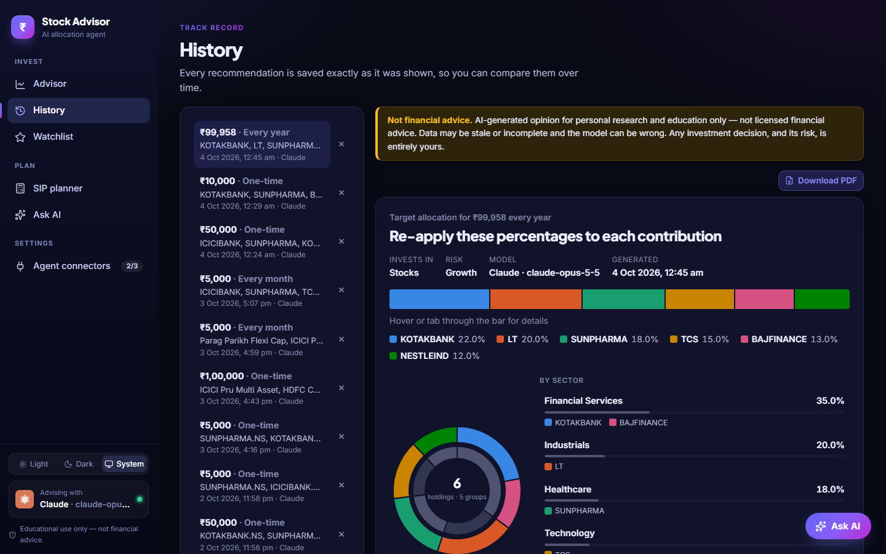

## The problem

Someone starting to invest in India runs into four problems at once:

1. **Too much choice, scattered data.** There are thousands of listed stocks and 1,700+ Direct-Growth mutual
   funds across 50 categories. Prices, fundamentals, news and fund NAV histories all live on different sites.
2. **Advice without reasons.** Tips on social media and most robo-advisors say *what* to buy, not *why*, and
   rarely say what could go wrong.
3. **Calculators that hide risk.** A typical SIP calculator assumes a fixed 12% a year and shows one big
   number, as if markets never fall.
4. **Chatbots that invent numbers.** Ask a general AI chatbot how a fund has done and it will often answer
   confidently with figures that are out of date or simply made up.

## The solution

Stock Advisor is a full-stack app (React + FastAPI) built around an AI agent that **only reasons over data it
has fetched itself**:

| Problem | How the app solves it |
|---|---|
| Too much choice, scattered data | The backend pulls a year of prices, fundamentals and news for each stock (Yahoo Finance) and full NAV history for each fund (mfapi.in). It computes returns, RSI, volatility, drawdown, CAGR and Sharpe ratio, then **pre-scores every candidate with transparent rules** for your risk level and shortlists the best before the AI sees them. |
| Advice without reasons | The AI model (Claude, Gemini or a local Ollama model) picks 2–6 holdings and must justify each one with the numbers. The app shows the reasoning, the **risks**, and every candidate it **rejected** with its score. History then tracks **how each recommendation has done since**. |
| Calculators that hide risk | The SIP planner runs **4,000 simulated market paths** on a fund's real monthly returns and shows a **bad / typical / good** range, plus your chance of hitting a goal. *What would have happened* replays a real past SIP month by month at actual NAVs, with XIRR and a fixed-deposit comparison. |
| Chatbots that invent numbers | The **Ask AI** assistant has to use tools — search funds, fund and stock details, compare funds, run the SIP maths, read your saved recommendations — and the app shows each result as a card next to the answer. Every figure it quotes comes from a tool result. |

It also runs the way an individual would want: pick your model and sign in with your browser or an API key
(stored in the OS keychain), or stay fully offline with Ollama. Results can be downloaded as PDF, and the UI
works in light and dark mode and on phones.

## Screenshots

| | |
|---|---|
| **1. Plan the investment** — four steps and a live summary. 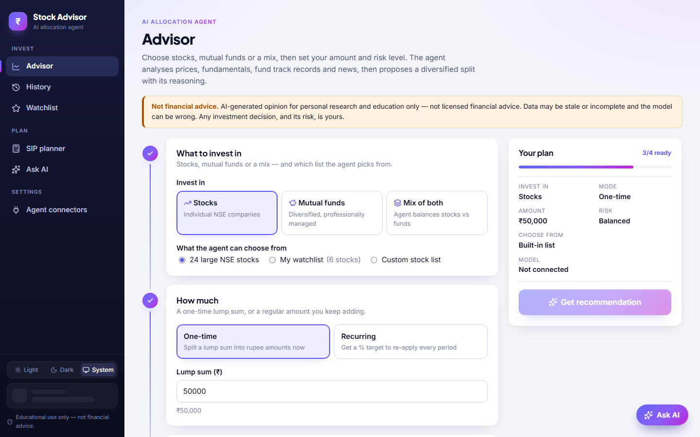 | **2. The agent at work** — live progress while it fetches data, scores candidates and asks the model. 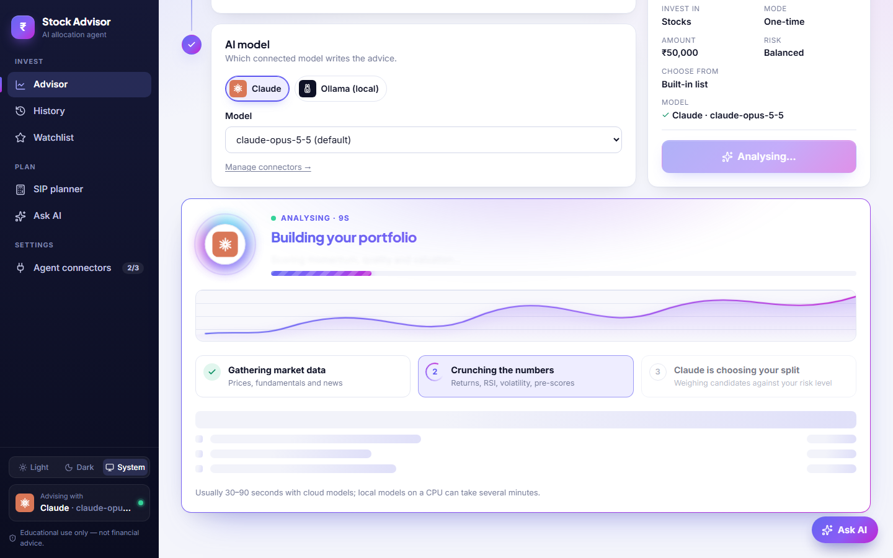 |
| **3. The recommended split** — allocation bar, holdings-and-sectors donut, and what each amount buys. 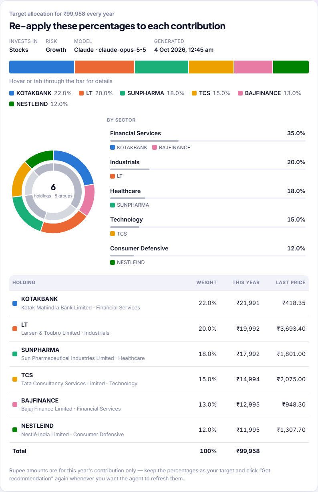 | **4. Why, and what could go wrong** — short reasoning per pick and the key risks. 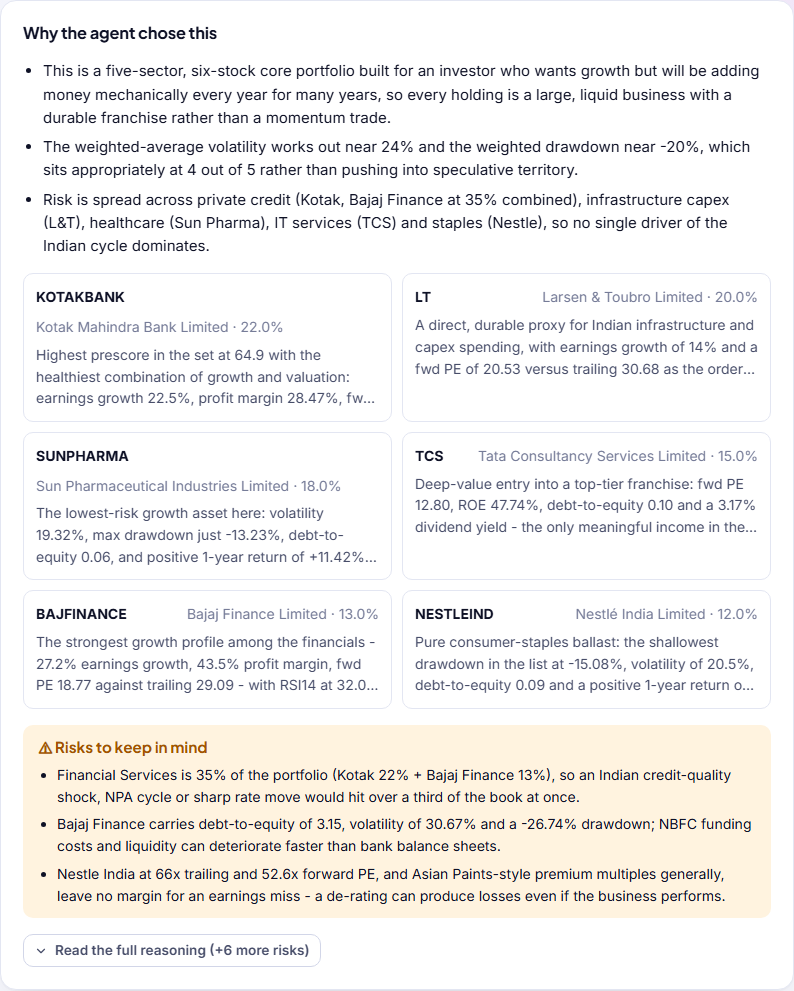 |
| **5. How it has done since** — each holding's price then vs now. 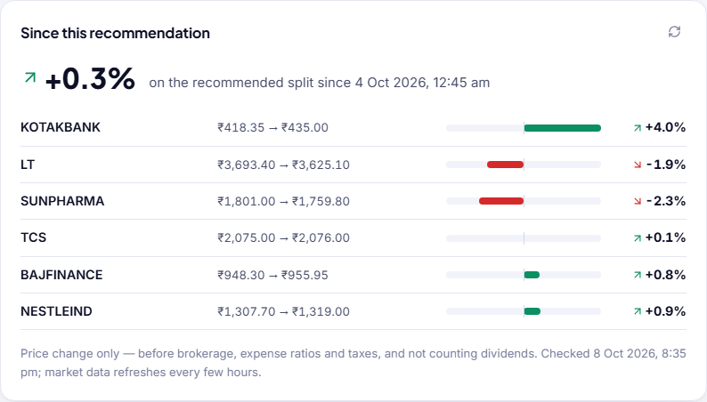 | **6. Ask AI, grounded in real data** — the comparison card comes from a tool call, not the model's memory. 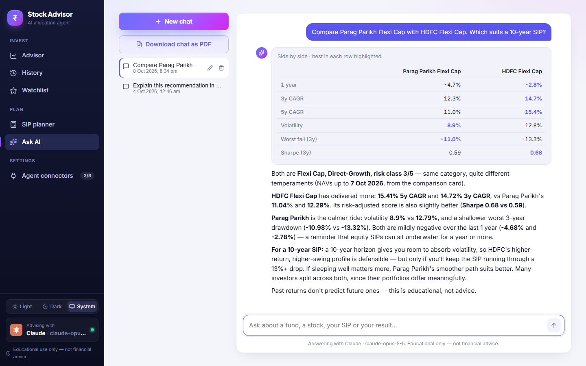 |
| **7. SIP projection as a range** — 4,000 simulated paths on the fund's real history. 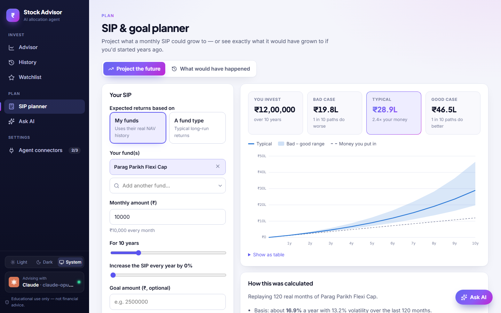 | **8. Replay a real past SIP** — month by month at actual NAVs, with XIRR vs a fixed deposit. 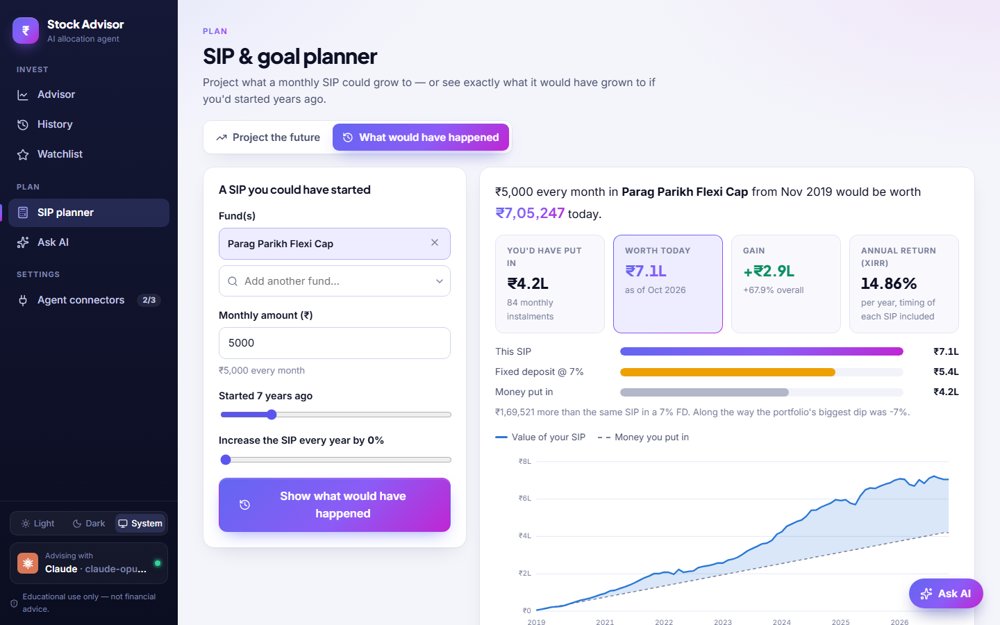 |
| **9. Bring your own model** — Claude, Gemini or local Ollama; browser login or API key. 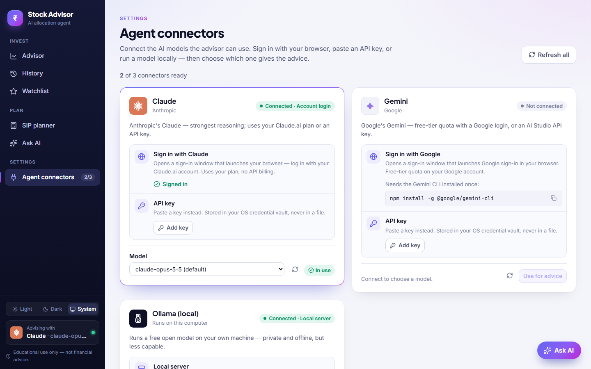 | **10. Ask AI while it works** — live status as each tool runs. 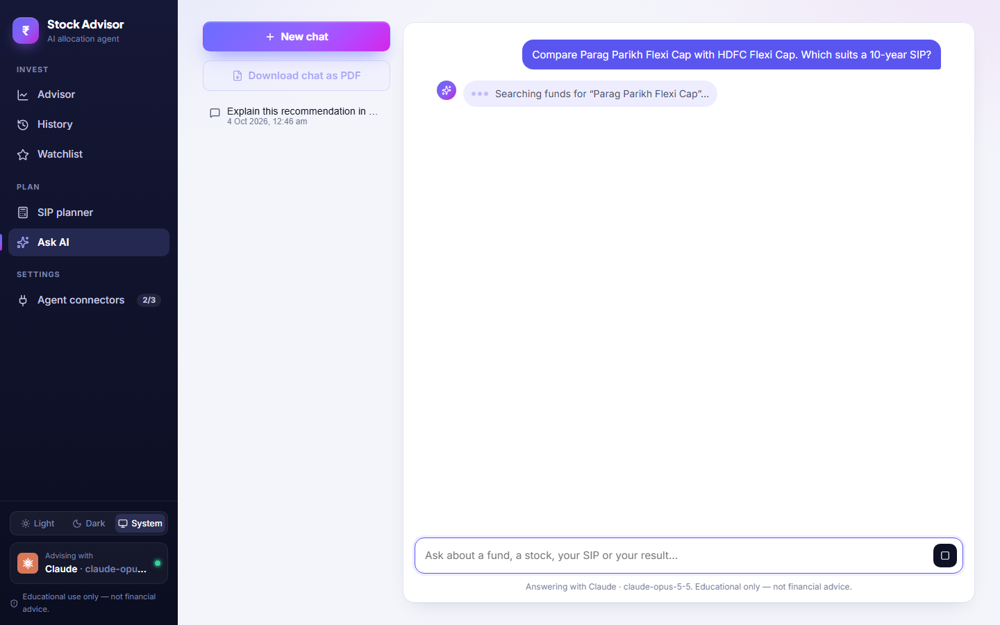 |

**On a phone** — bottom tab bar, full-screen chat, dark mode:

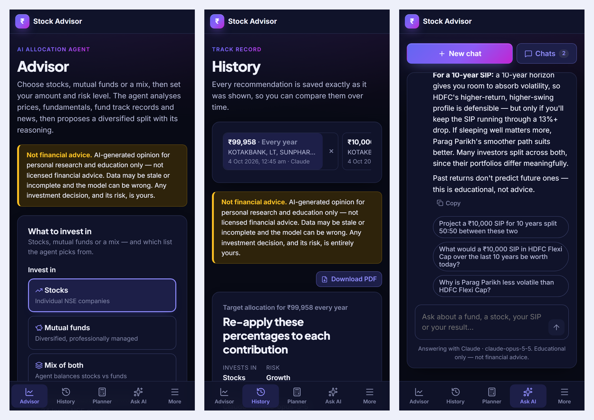

## Engineering highlights

What was hard, and how it was solved:

- **One agent, three very different LLMs.** Claude, Gemini and Ollama expose different features, so the chat
  assistant doesn't rely on any vendor's tool-calling API. On each step the model replies with one small JSON
  message — "call this tool" or "here's the answer" — and the backend runs the tool. Ollama gets a JSON
  schema to constrain its output; the others follow the prompt.
- **LLMs don't always return valid JSON.** Long, detailed replies sometimes contain quotes inside strings, a
  note after the JSON, or a line break in the middle of a value. The parser tolerates all of these, detects
  replies that were cut off, and asks the model to repair its answer once before giving up.
- **Live progress instead of a frozen screen.** Agent turns take 30–90 seconds, so the chat streams its status
  ("Searching funds…"), cards and answer over Server-Sent Events as they happen.
- **Realistic SIP maths.** Projections resample 12-month blocks of a fund's real returns (a block bootstrap),
  which keeps the clustered ups and downs a fixed-rate calculator misses. XIRR is solved numerically.
- **Fast, forgiving fund search.** All Indian funds are downloaded daily from AMFI into SQLite and an in-memory
  index, so search works as you type and understands abbreviations and old names (`ppfas` → Parag Parikh,
  `bluechip` → Large Cap).
- **Tested end to end.** 82 pytest tests cover the indicators, scoring, SIP maths, the reply parser, the chat
  tool loop and the full API with fake market data and a fake model. UI changes were checked in a real
  browser with Playwright.

## Features

The app has a sidebar with these pages:

| Section | Page | What you can do |
|---|---|---|
| Invest | **Advisor** | Four numbered steps (what to invest in → how much → risk → AI model) with a live "Your plan" summary, then an AI-recommended split with reasons, risks, an allocation bar, a **holdings-and-sectors donut** and a table. An animated progress screen shows what the agent is doing while it works. |
| Invest | **History** | Every recommendation, saved exactly as shown, with **how it has done since** (each holding's price or NAV then vs now, and the split's overall change). Open, compare, download as PDF, or delete with Undo. |
| Invest | **Watchlist** | Two tabs: your own **stocks** and **mutual funds** for the agent to choose from. Funds are picked from a searchable list of every Indian fund. |
| Plan | **SIP planner** | *Project the future* (a range of outcomes and your goal odds) or *What would have happened* (an exact replay of a past SIP with XIRR). |
| Plan | **Ask AI** | Chat with the assistant: it explains your recommendations, looks up real fund and stock numbers, runs the SIP calculators and explains investing terms. Chats are saved. It's also a floating **Ask AI** button on every page. |
| Settings | **Agent connectors** | Connect Claude / Gemini (browser login or API key) or a local Ollama model, and choose which one gives advice. |

- **Theme:** Light, Dark or System (follows your computer), switched at the bottom of the sidebar and remembered.
- **Download as PDF:** every recommendation has a *Download PDF* button, and any Ask AI chat can be saved as a PDF
  (cards and charts included). It opens the browser's print dialog, so choose **Save as PDF**. PDFs always print in
  the light theme.
- **Times** are stored in UTC and always shown in your computer's local time zone.
- **Feedback:** small toasts confirm actions ("Added to watchlist"), and deleting a recommendation, chat or watchlist
  item can be **undone** for a few seconds. Pages show loading placeholders instead of blank screens, and empty pages
  offer a one-click **Try an example**.
- **Phones:** a bottom tab bar (Advisor · History · Planner · Ask AI · More), a full-screen chat, and a swipeable
  history list.

## How it works

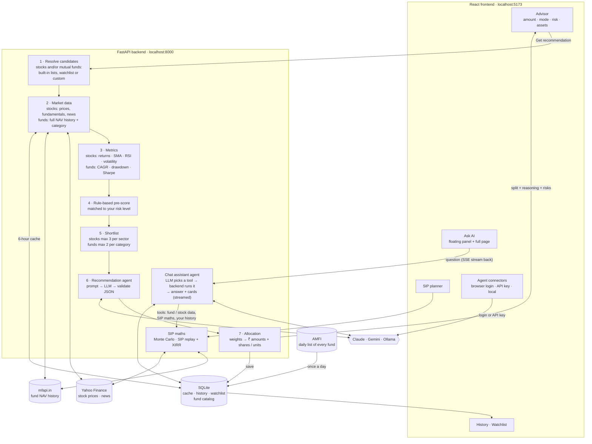

**A recommendation, step by step**

1. You choose stocks, funds or a mix, an amount (one-time or SIP), a risk level (1–5), and which list to pick from.
2. The backend fetches data and caches it for 6 hours. For stocks that's a year of daily prices, the latest
   fundamentals and recent headlines from Yahoo Finance. For funds it's the full NAV history from mfapi.in.
3. It computes metrics. For stocks: returns, moving averages, RSI, volatility and max drawdown. For funds: 1-year
   return, 3- and 5-year CAGR, volatility, worst drawdown and Sharpe ratio.
4. Each candidate gets a transparent 0–100 pre-score, weighted for your risk level. Funds also get a 1–5 risk class
   from their category (liquid/debt up to small cap).
5. The best candidates go to the AI model: up to 12 stocks and 10 funds, fewer for Ollama, with at most 3 stocks per
   sector and 2 funds per category.
6. The model picks 2–6 holdings and weights them. In a mix it also decides the stock/fund balance. The backend
   validates the reply, drops unknown tickers, makes the weights add to 100% and retries once if the reply is
   malformed.
7. Weights become rupee amounts, plus whole shares for stocks or units for funds, and the result is saved to History.

| Invest in | What the agent chooses from |
|---|---|
| **Stocks** | 24 large NSE stocks, your stock watchlist, or a custom ticker list |
| **Mutual funds** | 18 popular Direct-Growth funds (index, large/flexi/mid/small cap, ELSS, hybrid, debt, gold), or the funds on your watchlist |
| **Mix of both** | Both lists. The agent sets the stock/fund balance from your risk level, and conservative investors get more funds. |

| Mode | Output |
|---|---|
| **One-time** | Rupee amount per holding, plus whole shares (stocks) or units (funds) it buys |
| **Recurring** (monthly/yearly SIP) | Target **% allocation** to re-apply to each contribution (plus this period's rupee split) |

### SIP planner

| Page | What it does |
|---|---|
| **SIP planner** | Two modes. **Project the future:** a monthly SIP, with optional yearly step-up and goal, shown as a **bad / typical / good** range from 4,000 simulated paths. Returns come from either your own funds' real NAV history (any 1–5 funds, your split) or a fund-type assumption. You also see the chance of hitting your goal and the SIP needed for 50% / 80% confidence. **What would have happened:** replays a real past SIP month by month at actual NAVs (e.g. ₹10,000/month in Parag Parikh since 2016) and reports the value today, the XIRR, the same SIP in a 7% FD, and the worst dip along the way. |

### Ask AI (chat assistant)

Click **Ask AI** (bottom-right on any page, or in the sidebar) and ask in plain words. Examples:

- *"Explain this recommendation in simple words"* or *"What are the biggest risks here?"* on a result. The
  assistant knows which recommendation you're looking at. Results also show these as one-click questions.
- *"How has Parag Parikh Flexi Cap done?"* or *"Compare HDFC Mid-Cap with Kotak Emerging Equity"*.
- *"What would ₹10,000 a month in Parag Parikh for 10 years become?"* (projection) or *"…if I'd started 5 years
  ago?"* (replay at real NAVs).
- *"What is XIRR?"* or *"Why does my fund have a negative 1-year return?"*

How it works: the model never makes numbers up. On each step it replies with a small JSON message: either a
**tool call** (search funds, fund details, compare funds, stock details, project SIP, replay past SIP, read a saved
recommendation, list your recommendations) or the **final answer**. The backend runs the tool on real data, feeds
the result back, and the model answers (at most 4 tools per question). This works the same on Claude, Gemini and
Ollama. Tool results appear in the chat as **cards**: fund and stock cards, a comparison table, the SIP charts, or
your allocation bar. You also get suggested follow-up questions, and live status ("Searching funds…") is streamed
while it works. Every chat is saved on the Ask AI page, where you can rename or delete it. It answers with the model
chosen in Agent connectors.

### Finding a fund

Every fund picker (SIP planner, Watchlist) searches a **local copy of all active Indian mutual funds**. The list is
downloaded from AMFI once a day, so results appear as you type. You don't need the exact name:

- Click the fund box to open a dropdown of **every fund** (popular ones first, then A–Z) and scroll. Or **type any
  part** of the name to filter it, in any order: `par fle`, `hdfc mid`, `sbi small`. A category filter inside the
  dropdown is optional.
- Abbreviations and old names work: `pru` → Prudential, `ppfas` → Parag Parikh, `bluechip` → Large Cap,
  `long term equity` → ELSS, and `midcap` = `mid cap`.
- Only Direct · Growth plans are shown by default because they cost less. Tick *Regular / IDCW too* to see the rest.
- Use ↑ / ↓ and Enter to pick from the keyboard.

### Connecting a model

Open **Agent connectors** in the sidebar. Each model has its own card:

| Model | Connect with browser | Or |
|---|---|---|
| Claude | Opens Claude's sign-in in your browser and uses your Claude.ai plan (needs [Claude Code](https://claude.com/claude-code)) | Paste an Anthropic API key |
| Gemini | Opens Google sign-in and uses your free-tier quota (needs the `gemini` CLI) | Paste a Google AI Studio API key |
| Ollama | No login: runs on your machine with `ollama serve` and a pulled model | — |
| OpenCode | Connect any provider it supports in a terminal (`opencode auth login`), including a local llama.cpp server | — |

API keys go into your **OS credential vault** (Windows Credential Manager / macOS Keychain via
`keyring`). They're never written to a file and are never returned by the API.

## Project structure

```
stock-advisor-agent/
├── backend/                                Python · FastAPI
│   ├── app/
│   │   ├── main.py                         App factory, CORS, lifespan (DB init)
│   │   ├── core/
│   │   │   ├── app_settings.py             Typed settings (env: STOCK_ADVISOR_*)
│   │   │   ├── app_exceptions.py           Domain errors → HTTP status mapping
│   │   │   ├── utc_time.py                 Timestamps always sent as UTC ("…Z"), shown locally by the browser
│   │   │   └── logging_config.py
│   │   ├── db/
│   │   │   ├── database_session.py         Engine, session factory, FastAPI dependency
│   │   │   ├── orm_models.py               Tables: watchlists, data cache, history, fund catalog, chats
│   │   │   └── repositories/               Queries only, one file per table:
│   │   │       ├── watchlist_repository.py · watchlist_fund_repository.py
│   │   │       ├── market_data_cache_repository.py · recommendation_repository.py
│   │   │       └── fund_catalog_repository.py · chat_repository.py
│   │   ├── schemas/                        Pydantic request/response contracts:
│   │   │   ├── recommendation_schemas.py   Requests, allocations, history
│   │   │   ├── market_data_schemas.py      Stock snapshots and scores
│   │   │   ├── mutual_fund_schemas.py      Fund snapshots, scores, search results, categories
│   │   │   ├── sip_planner_schemas.py      SIP projection + historical replay
│   │   │   ├── provider_schemas.py         AI connector status
│   │   │   ├── chat_schemas.py             Ask-AI conversations, messages, send request
│   │   │   └── watchlist_schemas.py
│   │   ├── data_sources/
│   │   │   ├── default_stock_universe.py   24 NSE large caps + ticker normalizing
│   │   │   ├── yfinance_market_data_client.py  Stock prices + fundamentals (Yahoo)
│   │   │   ├── news_headlines_client.py    Yahoo search news (+ optional Finnhub)
│   │   │   ├── default_fund_universe.py    18 popular Direct-Growth funds + fund risk classes
│   │   │   ├── amfi_fund_catalog_client.py Every active scheme from AMFI's daily NAV file
│   │   │   ├── fund_search_aliases.py      Forgiving search: abbreviations, old names, ranking
│   │   │   ├── mfapi_mutual_fund_client.py NAV history per fund (mfapi.in)
│   │   │   └── historical_returns_client.py Monthly returns from NAVs for SIP projections
│   │   ├── analysis/
│   │   │   ├── technical_indicators.py     SMA, RSI, returns, volatility, drawdown
│   │   │   ├── fundamentals_extractor.py
│   │   │   ├── candidate_scoring.py        Stock pre-score + sector-capped shortlist
│   │   │   ├── stock_snapshot_builder.py   Cache-aware per-stock data assembly
│   │   │   ├── fund_metrics.py             CAGR, volatility, drawdown, Sharpe from NAVs
│   │   │   ├── fund_scoring.py             Fund pre-score + category-capped shortlist
│   │   │   ├── fund_snapshot_builder.py    Cache-aware per-fund data assembly
│   │   │   ├── sip_simulator.py            Monte Carlo SIP projection (bootstrap / log-normal)
│   │   │   └── sip_backtester.py           Replays a real past SIP at actual NAVs + XIRR
│   │   ├── agent/
│   │   │   ├── recommendation_agent.py     Prompt → LLM → parse (with one self-repair retry)
│   │   │   ├── recommendation_prompt_builder.py  Stocks, funds or mixed prompts
│   │   │   ├── recommendation_response_parser.py
│   │   │   ├── allocation_calculator.py    % → ₹ amounts + shares / units
│   │   │   └── providers/
│   │   │       ├── base_llm_provider.py    The one interface every provider implements
│   │   │       ├── claude_provider.py      Claude Code CLI login or Anthropic API key
│   │   │       ├── gemini_provider.py      Gemini CLI Google login or API key
│   │   │       ├── ollama_provider.py      Local Ollama server (schema-constrained JSON)
│   │   │       ├── opencode_provider.py    Any model via the OpenCode CLI (e.g. local llama.cpp)
│   │   │       ├── cli_process_runner.py   Run vendor CLIs / open login terminals
│   │   │       └── llm_provider_registry.py
│   │   ├── assistant/                      Ask-AI chat agent:
│   │   │   ├── assistant_tools.py          Tools on real data (funds, stocks, SIP maths, history) + their cards
│   │   │   ├── assistant_prompt_builder.py Rules, tool list, context, conversation, tool results
│   │   │   └── assistant_agent.py          Loop: LLM → tool → LLM … → answer, yielding live events
│   │   ├── security/api_key_vault.py       OS-keyring storage for API keys
│   │   ├── services/                       Use-case orchestration:
│   │   │   ├── recommendation_service.py   The full recommendation pipeline
│   │   │   ├── recommendation_history_service.py
│   │   │   ├── stock_universe_service.py   Which stocks / funds a request considers
│   │   │   ├── watchlist_service.py        Stock watchlist
│   │   │   ├── mutual_fund_service.py      Fund search + fund watchlist
│   │   │   ├── fund_catalog_service.py     Daily AMFI download + in-memory search index
│   │   │   ├── recommendation_performance_service.py  "Since this recommendation": then vs now prices
│   │   │   ├── sip_planner_service.py      SIP projection + historical replay
│   │   │   └── chat_service.py             Saved chats + one streamed (SSE) assistant turn
│   │   └── api/
│   │       ├── api_router.py               Mounts every route module under /api
│   │       └── routes/                     health · providers · recommendations · watchlist ·
│   │                                       stock_universe · mutual_fund · planning · chat
│   ├── tests/                              pytest (unit + end-to-end API with fakes)
│   ├── pyproject.toml · uv.lock            Dependencies (managed with uv) + exact locked versions
│   ├── .python-version                     Python 3.10
│   └── .env.example                        Every setting you can override
│
├── frontend/                               React 18 · TypeScript · Vite
│   └── src/
│       ├── main.tsx · App.tsx              Entry + routes: / · /history/:id · /watchlist ·
│       │                                   /planner · /assistant · /connectors
│       ├── api/                            httpClient + one client per backend area:
│       │                                   recommendation · provider · watchlist · mutualFund ·
│       │                                   planning · stockUniverse · chat (streams SSE)
│       ├── types/                          *.types.ts mirroring backend schemas
│       ├── context/ProviderConnectionsContext.tsx  App-wide connector status + active model
│       ├── context/AssistantContext.tsx    Shared chat state (panel + page), page context, streaming
│       ├── context/PrintContext.tsx        "Download PDF": renders a print-only sheet, opens Save as PDF
│       ├── context/ToastContext.tsx        Toasts + delete-with-Undo
│       ├── hooks/useProviderStatuses.ts    Provider status + login polling
│       ├── hooks/useThemePreference.ts     Light / Dark / System, saved in the browser
│       ├── pages/                          AdvisorPage · HistoryPage · WatchlistPage ·
│       │                                   SipPlannerPage · AssistantPage · AgentConnectorsPage
│       ├── components/
│       │   ├── layout/                     AppShell · AppSidebar · MobileTabBar · ThemeToggle · PageHeader ·
│       │   │                               DisclaimerBanner
│       │   ├── common/                     FundSearchCombobox (pick any fund) · PrintableDocument (PDF letterhead) ·
│       │   │                               Skeleton · EmptyState · CountUp (animated numbers) ·
│       │   │                               StatTile · ErrorAlert · LoadingSpinner · CopyableCommand
│       │   ├── connectors/                 ConnectorCard · ProviderLogo · ConnectorStatusBadge · ApiKeyForm
│       │   ├── investment-form/            InvestmentForm · FormStep · AssetMixToggle · InvestmentModeToggle ·
│       │   │                               RiskLevelSlider · StockUniversePicker
│       │   ├── model-picker/               ActiveModelSelector (compact chooser on the Advisor page)
│       │   ├── recommendation/             RecommendationResults · AllocationStackedBar · AllocationDonut ·
│       │   │                               PerformanceSincePanel · AllocationTable ·
│       │   │                               AgentReasoningPanel · CandidatesConsideredTable · AssetTypePill ·
│       │   │                               RecommendationProgress (animated loader)
│       │   ├── planner/                    FundPicker · SipProjectionResults · SipProjectionChart ·
│       │   │                               SipBacktestResults · SipBacktestChart
│       │   ├── assistant/                  AssistantPanel (floating button + panel) · ChatThread ·
│       │   │                               ChatCards · ChatMarkdown (safe Markdown renderer)
│       │   ├── history/                    RecommendationHistoryList
│       │   └── watchlist/                  WatchlistManager (stocks) · FundWatchlistManager
│       ├── utils/                          displayFormatters (₹, %, units) · investmentLabels
│       └── styles/global.css               Design tokens, light/dark themes, animations
│
├── docs/screenshots/                       Images used in this README
│
└── scripts/                                Dev tooling (run everything from here)
    ├── setup.mjs                           npm run setup: checks tools, installs everything
    ├── run-backend.mjs                     Starts uvicorn (or pytest) via `uv run`
    ├── backend-environment.mjs             Keeps the Python env out of OneDrive
    ├── start-dev.cmd                       Windows double-click launcher
    └── package.json                        npm run setup / dev / test
```

## API

Interactive docs: **http://localhost:8000/docs** (while the backend runs). All routes live under `/api`.

| Area | Endpoints |
|---|---|
| Recommendations | `POST /recommendations` · `GET /recommendations` (history) · `GET /recommendations/{id}` · `GET /recommendations/{id}/performance` (then vs now) · `DELETE /recommendations/{id}` |
| AI connectors | `GET /providers` · `GET /providers/{id}` · `POST /providers/{id}/login` · `PUT` / `DELETE /providers/{id}/api-key` |
| Stocks | `GET /stocks/default-universe` · `GET /stocks/{ticker}/snapshot` |
| Stock watchlist | `GET /watchlist` · `POST /watchlist` · `DELETE /watchlist/{ticker}` |
| Mutual funds | `GET /funds/search?q=&category=&include_all_plans=` · `GET /funds/categories` · `GET /funds/default-universe` |
| Fund watchlist | `GET /watchlist/funds` · `POST /watchlist/funds` · `DELETE /watchlist/funds/{scheme_code}` |
| SIP planner | `GET /planner/return-presets` · `POST /planner/sip` (projection) · `POST /planner/sip-backtest` (what would have happened) |
| Ask AI chat | `GET` / `POST /chat/conversations` · `GET` / `PATCH` / `DELETE /chat/conversations/{id}` · `POST /chat/conversations/{id}/messages` (Server-Sent Events: `status` → `card` → `answer` → `done` or `error`) |
| Health | `GET /health` |

## Getting started

### 1. Install the prerequisites (once per computer)

| Tool | Why | Install | Check |
|---|---|---|---|
| **Node.js 20+** | Runs the React frontend and the dev scripts | https://nodejs.org (LTS) | `node --version` |
| **uv** | Installs Python 3.10 and the backend packages | Windows: `powershell -ExecutionPolicy ByPass -c "irm https://astral.sh/uv/install.ps1 \| iex"`<br>macOS/Linux: `curl -LsSf https://astral.sh/uv/install.sh \| sh` | `uv --version` |

You don't need to install Python yourself. uv downloads the right version if it's missing.

You need **at least one AI model** to get recommendations. Pick one or more. (The SIP planner works without any
AI model.)

| Model | Install | How it connects |
|---|---|---|
| **Claude** (recommended) | [Claude Code](https://claude.com/claude-code): `npm install -g @anthropic-ai/claude-code` | Browser login with your Claude.ai account, or an API key |
| **Gemini** | `npm install -g @google/gemini-cli` | Browser login with your Google account, or an API key |
| **Ollama** (free, offline) | https://ollama.com, then `ollama pull llama3.1` | Runs locally with no login. Slow without a GPU (several minutes per recommendation) |
| **OpenCode** | `npm install -g opencode-ai` (or https://opencode.ai) | Runs any model OpenCode is configured with, e.g. a local llama.cpp server (`opencode models` lists them) |

### 2. Install the project (once, and again after pulling new changes)

```bash
cd scripts
npm run setup
```

This checks your tools, then installs everything:

1. **Backend:** `uv sync` installs Python and the exact packages from `backend/uv.lock`
2. **Frontend:** `npm install` in `frontend/`
3. **Dev runner:** `npm install` in `scripts/`

> **Project inside OneDrive?** OneDrive locks the package files of a Python environment, which
> makes installs fail with "Access is denied". The scripts detect this and keep the backend's
> environment in `%LOCALAPPDATA%\stock-advisor-agent\backend-venv` instead of `backend/.venv`.
> Your code stays where it is.

### 3. Run the app

**Windows:** double-click **`scripts\start-dev.cmd`** (it runs setup automatically the first time).

**Any OS:**

```bash
cd scripts
npm run dev
```

This starts both servers in one terminal:

| Server | URL | Log prefix |
|---|---|---|
| Backend (FastAPI) | http://localhost:8000. API docs at http://localhost:8000/docs | `[api]` (magenta) |
| Frontend (React) | **http://localhost:5173**, the app itself | `[web]` (cyan) |

Open **http://localhost:5173**. Press **Ctrl+C** once to stop both.

### 4. Connect a model and get a recommendation

1. In the app, open **Agent connectors** in the sidebar.
2. On a model's card, click **Connect with browser** (Claude/Gemini) and finish signing in. The card
   turns *Connected* by itself. Or click **Add key** to paste an API key, or start Ollama.
3. Click **Use for advice** on the model you want.
4. Go to **Advisor**, choose stocks / mutual funds / mix, enter an amount and risk level, and click
   **Get recommendation**. It takes about 30–90 s with Claude.
5. To plan a monthly SIP, open **SIP planner**, pick your fund(s), and see the projection or what it would have
   returned in the past.

### Everyday commands

All of these run from the `scripts/` folder:

| Command | What it does |
|---|---|
| `npm run setup` | Install or update everything (after `git pull`, or if something is missing) |
| `npm run dev` | Start backend + frontend together |
| `npm test` | Backend tests (pytest) + frontend type-check and build |
| `npm run dev:api` | Start only the backend |
| `npm run dev:web` | Start only the frontend |

### Running the servers by hand (optional)

```bash
# Backend: terminal 1
cd backend
uv sync
uv run uvicorn app.main:app --reload --reload-dir app --port 8000

# Frontend: terminal 2
cd frontend
npm install
npm run dev
```

`--reload-dir app` makes the backend restart only when your code changes. Without it, uvicorn also
watches the virtualenv and restarts endlessly while OneDrive syncs it. If the project is inside
OneDrive, set `$env:UV_PROJECT_ENVIRONMENT="$env:LOCALAPPDATA\stock-advisor-agent\backend-venv"`
first, so the manual commands use the same environment as the scripts.

### Managing Python packages (uv)

```bash
cd backend
uv add <package>          # add a dependency (updates pyproject.toml + uv.lock)
uv add --dev <package>    # add a dev-only tool
uv remove <package>
uv lock --upgrade         # bump everything to the newest allowed versions
```

Commit `pyproject.toml` and `uv.lock` together. The virtualenv is never committed.

### Troubleshooting

| Problem | Fix |
|---|---|
| `port already in use` / `WinError 10013` | Something from an earlier run is still running. Close old terminals, or run `Get-Process python, node \| Stop-Process` (PowerShell), then start again. |
| `Access is denied` during `uv sync` | The backend is still running and locking its packages. Stop it (Ctrl+C), then `npm run setup` again. |
| `EPERM ... node_modules\.vite` | OneDrive locked Vite's cache. This is already handled: the cache lives in your temp folder (`vite.config.ts`). |
| Claude shows *Not connected* | Run `claude auth status` in a terminal. If logged out, click **Connect with browser** on the Claude card. |
| Ollama is very slow / times out | It's running on your CPU. Try a smaller model (`ollama pull llama3.2:3b`) or use Claude. |
| "The model's reply wasn't valid JSON" | Try again or use a stronger model. The error shows what the model actually replied. |
| The fund list is slow the first time | The first search of the day downloads AMFI's fund list (~1.5 MB, a few seconds). After that it's instant. If AMFI can't be reached, the last list is reused. |
| "Only has N years of NAV history" in the SIP planner | The fund is newer than the period you chose. Pick fewer years or an older fund. |

## Configuration

Copy `backend/.env.example` to `backend/.env` and uncomment what you want to change. Every setting is listed there:
AI model defaults and timeouts, the Ollama URL, the price-history period and cache time, how many stocks/funds the
AI sees, an optional Finnhub key for extra news, and the database location.

## Notes and limits

- **Data sources:** stock data comes from Yahoo Finance via `yfinance` (free, unofficial). Mutual fund NAVs come from
  [mfapi.in](https://www.mfapi.in) and the list of all funds from [AMFI](https://www.amfiindia.com), both free.
  Market data is cached for 6 hours and the fund list is refreshed daily.
- **Funds:** mfapi.in doesn't provide expense ratios or fund size (AUM), so the agent can't weigh those.
- **Tickers:** plain tickers default to NSE (`INFY` → `INFY.NS`). Use `.BO` for BSE or a full Yahoo symbol for
  other exchanges.
- **SIP projections** are a range, not a promise. Replaying the last decade (a strong market) gives optimistic results.
  Figures are before tax and not adjusted for inflation. *What would have happened* is exact for the past at real NAVs
  but assumes buying on the first business day of each month.
- The app **never places trades**. Recurring mode gives target percentages; you invest yourself.
- **Ask AI** answers take a few seconds per step: one model call per tool, so a question that needs three
  lookups makes four calls. Small local Ollama models may pick the wrong tool more often than Claude or Gemini.
- With the Claude CLI login, the model is passed as a family alias (`opus`/`sonnet`/`haiku`) so
  older Claude Code builds still work. With an API key, the exact model id is used.
