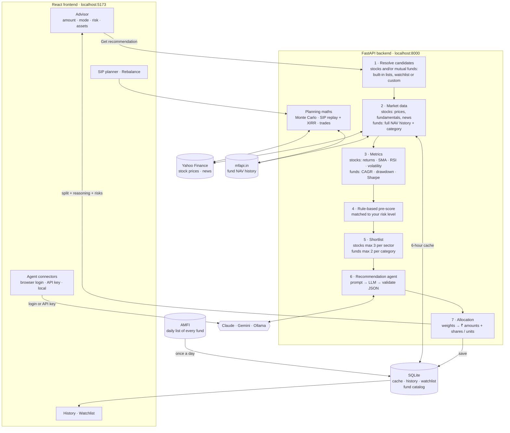

# Stock Advisor Agent

> **Not financial advice.** This app produces AI-generated opinions for personal research and
> education only. Data can be stale or incomplete and the model can be wrong. Any money you invest
> based on its output is your own decision and risk.

Choose **stocks, mutual funds, or a mix of both**, enter an amount (one-time or a monthly/yearly SIP)
and a risk preference, then pick an AI model (**Claude**, **Gemini** or a local **Ollama** model).
The agent pulls price history, fundamentals and news for Indian stocks and NAV track records for
mutual funds, scores them, and asks the model to propose a diversified split, with its reasoning,
the risks, and the whole shares or fund units each amount buys. Planning tools then let you project
a SIP, replay one from the past, and rebalance your real portfolio.

  

## Features

The app has a sidebar with these pages:

| Section | Page | What you can do |
|---|---|---|
| Invest | **Advisor** | Pick stocks / mutual funds / mix, amount, one-time or SIP, risk level and which list to choose from, then get an AI-recommended split with reasons, risks, a chart and a table. An animated progress screen shows what the agent is doing while it works. |
| Invest | **History** | Every recommendation, saved exactly as shown. Open, compare, or delete them. |
| Invest | **Watchlist** | Two tabs: your own **stocks** and **mutual funds** for the agent to choose from. Funds are picked from a searchable list of every Indian fund. |
| Plan | **SIP planner** | *Project the future* (a range of outcomes and your goal odds) or *What would have happened* (an exact replay of a past SIP with XIRR). |
| Plan | **Rebalance** | Paste your broker holdings and get the exact buy / sell / hold trades to reach a recommended split. |
| Settings | **Agent connectors** | Connect Claude / Gemini (browser login or API key) or a local Ollama model, and choose which one gives advice. |

Light and dark themes follow your system setting. The layout works on phones too, with the sidebar becoming a slide-out menu.

## How it works



**A recommendation, step by step**

1. You choose stocks, funds or a mix, an amount (one-time or SIP), a risk level (1–5), and which list to pick from.
2. The backend fetches data and caches it for 6 hours. For stocks that's a year of daily prices, the latest
   fundamentals and recent headlines from Yahoo Finance. For funds it's the full NAV history from mfapi.in.
3. It computes metrics. For stocks: returns, moving averages, RSI, volatility and max drawdown. For funds: 1-year
   return, 3- and 5-year CAGR, volatility, worst drawdown and Sharpe ratio.
4. Each candidate gets a transparent 0–100 pre-score, weighted for your risk level. Funds also get a 1–5 risk class
   from their category (liquid/debt up to small cap).
5. The best candidates go to the AI model: up to 12 stocks and 10 funds, fewer for Ollama, with at most 3 stocks per
   sector and 2 funds per category.
6. The model picks 2–6 holdings and weights them. In a mix it also decides the stock/fund balance. The backend
   validates the reply, drops unknown tickers, makes the weights add to 100% and retries once if the reply is
   malformed.
7. Weights become rupee amounts, plus whole shares for stocks or units for funds, and the result is saved to History.

| Invest in | What the agent chooses from |
|---|---|
| **Stocks** | 24 large NSE stocks, your stock watchlist, or a custom ticker list |
| **Mutual funds** | 18 popular Direct-Growth funds (index, large/flexi/mid/small cap, ELSS, hybrid, debt, gold), or the funds on your watchlist |
| **Mix of both** | Both lists. The agent sets the stock/fund balance from your risk level, and conservative investors get more funds. |

| Mode | Output |
|---|---|
| **One-time** | Rupee amount per holding, plus whole shares (stocks) or units (funds) it buys |
| **Recurring** (monthly/yearly SIP) | Target **% allocation** to re-apply to each contribution (plus this period's rupee split) |

### Planning tools

| Page | What it does |
|---|---|
| **SIP planner** | Two modes. **Project the future:** a monthly SIP, with optional yearly step-up and goal, shown as a **bad / typical / good** range from 4,000 simulated paths. Returns can come from your own funds' real NAV history (any 1–5 funds, your split), a past recommendation, or a fund-type assumption. You also see the chance of hitting your goal and the SIP needed for 50% / 80% confidence. **What would have happened:** replays a real past SIP month by month at actual NAVs (e.g. ₹10,000/month in Parag Parikh since 2016) and reports the value today, the XIRR, the same SIP in a 7% FD, and the worst dip along the way. |
| **Rebalance** | Compares what you own with a recommended target and lists the exact **buy / sell / hold** trades: whole shares for stocks, units for funds. You can type your holdings in or paste a Zerodha / Groww / Upstox / Coin export; columns and names are matched automatically. Choose *Don't sell anything* (only invest new cash, so no capital-gains tax) or *Full rebalance*. It's pure arithmetic, no AI, so the numbers are exact. |

### Finding a fund

Every fund picker (SIP planner, Watchlist) searches a **local copy of all active Indian mutual funds**. The list is
downloaded from AMFI once a day, so results appear as you type. You don't need the exact name:

- Click the fund box to open a dropdown of **every fund** (popular ones first, then A–Z) and scroll. Or **type any
  part** of the name to filter it, in any order: `par fle`, `hdfc mid`, `sbi small`. A category filter inside the
  dropdown is optional.
- Abbreviations and old names work: `pru` → Prudential, `ppfas` → Parag Parikh, `bluechip` → Large Cap,
  `long term equity` → ELSS, and `midcap` = `mid cap`.
- Only Direct · Growth plans are shown by default because they cost less. Tick *Regular / IDCW too* to see the rest.
- Use ↑ / ↓ and Enter to pick from the keyboard.

### Connecting a model

Open **Agent connectors** in the sidebar. Each model has its own card:

| Model | Connect with browser | Or |
|---|---|---|
| Claude | Opens Claude's sign-in in your browser and uses your Claude.ai plan (needs [Claude Code](https://claude.com/claude-code)) | Paste an Anthropic API key |
| Gemini | Opens Google sign-in and uses your free-tier quota (needs the `gemini` CLI) | Paste a Google AI Studio API key |
| Ollama | No login: runs on your machine with `ollama serve` and a pulled model | — |

API keys go into your **OS credential vault** (Windows Credential Manager / macOS Keychain via
`keyring`). They're never written to a file and are never returned by the API.

## Project structure

```
stock-advisor-agent/
├── backend/                                Python · FastAPI
│   ├── app/
│   │   ├── main.py                         App factory, CORS, lifespan (DB init)
│   │   ├── core/
│   │   │   ├── app_settings.py             Typed settings (env: STOCK_ADVISOR_*)
│   │   │   ├── app_exceptions.py           Domain errors → HTTP status mapping
│   │   │   └── logging_config.py
│   │   ├── db/
│   │   │   ├── database_session.py         Engine, session factory, FastAPI dependency
│   │   │   ├── orm_models.py               Tables: watchlists, data cache, history, fund catalog
│   │   │   └── repositories/               Queries only, one file per table:
│   │   │       ├── watchlist_repository.py · watchlist_fund_repository.py
│   │   │       ├── market_data_cache_repository.py · recommendation_repository.py
│   │   │       └── fund_catalog_repository.py
│   │   ├── schemas/                        Pydantic request/response contracts:
│   │   │   ├── recommendation_schemas.py   Requests, allocations, history
│   │   │   ├── market_data_schemas.py      Stock snapshots and scores
│   │   │   ├── mutual_fund_schemas.py      Fund snapshots, scores, search results, categories
│   │   │   ├── sip_planner_schemas.py      SIP projection + historical replay
│   │   │   ├── rebalance_schemas.py        Holdings, trades, broker import
│   │   │   ├── provider_schemas.py         AI connector status
│   │   │   └── watchlist_schemas.py
│   │   ├── data_sources/
│   │   │   ├── default_stock_universe.py   24 NSE large caps + ticker normalizing
│   │   │   ├── yfinance_market_data_client.py  Stock prices + fundamentals (Yahoo)
│   │   │   ├── news_headlines_client.py    Yahoo search news (+ optional Finnhub)
│   │   │   ├── default_fund_universe.py    18 popular Direct-Growth funds + fund risk classes
│   │   │   ├── amfi_fund_catalog_client.py Every active scheme from AMFI's daily NAV file
│   │   │   ├── fund_search_aliases.py      Forgiving search: abbreviations, old names, ranking
│   │   │   ├── mfapi_mutual_fund_client.py NAV history per fund (mfapi.in)
│   │   │   └── historical_returns_client.py 10-year monthly returns for SIP projections
│   │   ├── analysis/
│   │   │   ├── technical_indicators.py     SMA, RSI, returns, volatility, drawdown
│   │   │   ├── fundamentals_extractor.py
│   │   │   ├── candidate_scoring.py        Stock pre-score + sector-capped shortlist
│   │   │   ├── stock_snapshot_builder.py   Cache-aware per-stock data assembly
│   │   │   ├── fund_metrics.py             CAGR, volatility, drawdown, Sharpe from NAVs
│   │   │   ├── fund_scoring.py             Fund pre-score + category-capped shortlist
│   │   │   ├── fund_snapshot_builder.py    Cache-aware per-fund data assembly
│   │   │   ├── sip_simulator.py            Monte Carlo SIP projection (bootstrap / log-normal)
│   │   │   ├── sip_backtester.py           Replays a real past SIP at actual NAVs + XIRR
│   │   │   └── rebalance_calculator.py     Buy / sell / hold trade maths
│   │   ├── agent/
│   │   │   ├── recommendation_agent.py     Prompt → LLM → parse (with one self-repair retry)
│   │   │   ├── recommendation_prompt_builder.py  Stocks, funds or mixed prompts
│   │   │   ├── recommendation_response_parser.py
│   │   │   ├── allocation_calculator.py    % → ₹ amounts + shares / units
│   │   │   └── providers/
│   │   │       ├── base_llm_provider.py    The one interface every provider implements
│   │   │       ├── claude_provider.py      Claude Code CLI login or Anthropic API key
│   │   │       ├── gemini_provider.py      Gemini CLI Google login or API key
│   │   │       ├── ollama_provider.py      Local Ollama server (schema-constrained JSON)
│   │   │       ├── cli_process_runner.py   Run vendor CLIs / open login terminals
│   │   │       └── llm_provider_registry.py
│   │   ├── security/api_key_vault.py       OS-keyring storage for API keys
│   │   ├── services/                       Use-case orchestration:
│   │   │   ├── recommendation_service.py   The full recommendation pipeline
│   │   │   ├── recommendation_history_service.py
│   │   │   ├── stock_universe_service.py   Which stocks / funds a request considers
│   │   │   ├── watchlist_service.py        Stock watchlist
│   │   │   ├── mutual_fund_service.py      Fund search + fund watchlist
│   │   │   ├── fund_catalog_service.py     Daily AMFI download + in-memory search index
│   │   │   ├── sip_planner_service.py      SIP projection + historical replay
│   │   │   ├── rebalance_service.py        Prices holdings, plans trades
│   │   │   └── holdings_import_service.py  Reads broker CSV exports
│   │   └── api/
│   │       ├── api_router.py               Mounts every route module under /api
│   │       └── routes/                     health · providers · recommendations · watchlist ·
│   │                                       stock_universe · mutual_fund · planning
│   ├── tests/                              pytest (unit + end-to-end API with fakes)
│   ├── pyproject.toml · uv.lock            Dependencies (managed with uv) + exact locked versions
│   ├── .python-version                     Python 3.10
│   └── .env.example                        Every setting you can override
│
├── frontend/                               React 18 · TypeScript · Vite
│   └── src/
│       ├── main.tsx · App.tsx              Entry + routes: / · /history/:id · /watchlist ·
│       │                                   /planner · /rebalance · /connectors
│       ├── api/                            httpClient + one client per backend area:
│       │                                   recommendation · provider · watchlist · mutualFund ·
│       │                                   planning · stockUniverse
│       ├── types/                          *.types.ts mirroring backend schemas
│       ├── context/ProviderConnectionsContext.tsx  App-wide connector status + active model
│       ├── hooks/useProviderStatuses.ts    Provider status + login polling
│       ├── pages/                          AdvisorPage · HistoryPage · WatchlistPage ·
│       │                                   SipPlannerPage · RebalancePage · AgentConnectorsPage
│       ├── components/
│       │   ├── layout/                     AppShell · AppSidebar · PageHeader · DisclaimerBanner
│       │   ├── common/                     FundSearchCombobox (pick any fund) · RecommendationPicker ·
│       │   │                               StatTile · ErrorAlert · LoadingSpinner · CopyableCommand
│       │   ├── connectors/                 ConnectorCard · ProviderLogo · ConnectorStatusBadge · ApiKeyForm
│       │   ├── investment-form/            InvestmentForm · AssetMixToggle · InvestmentModeToggle ·
│       │   │                               RiskLevelSlider · StockUniversePicker
│       │   ├── model-picker/               ActiveModelSelector (compact chooser on the Advisor page)
│       │   ├── recommendation/             RecommendationResults · AllocationStackedBar · AllocationTable ·
│       │   │                               AgentReasoningPanel · CandidatesConsideredTable · AssetTypePill ·
│       │   │                               RecommendationProgress (animated loader)
│       │   ├── planner/                    FundPicker · SipProjectionResults · SipProjectionChart ·
│       │   │                               SipBacktestResults · SipBacktestChart
│       │   ├── rebalance/                  HoldingsEditor (with broker import) · RebalanceResults
│       │   ├── history/                    RecommendationHistoryList
│       │   └── watchlist/                  WatchlistManager (stocks) · FundWatchlistManager
│       ├── utils/                          displayFormatters (₹, %, units) · investmentLabels
│       └── styles/global.css               Design tokens, light/dark themes, animations
│
└── scripts/                                Dev tooling (run everything from here)
    ├── setup.mjs                           npm run setup: checks tools, installs everything
    ├── run-backend.mjs                     Starts uvicorn (or pytest) via `uv run`
    ├── backend-environment.mjs             Keeps the Python env out of OneDrive
    ├── start-dev.cmd                       Windows double-click launcher
    └── package.json                        npm run setup / dev / test
```

## API

Interactive docs: **http://localhost:8000/docs** (while the backend runs). All routes live under `/api`.

| Area | Endpoints |
|---|---|
| Recommendations | `POST /recommendations` · `GET /recommendations` (history) · `GET /recommendations/{id}` · `DELETE /recommendations/{id}` |
| AI connectors | `GET /providers` · `GET /providers/{id}` · `POST /providers/{id}/login` · `PUT` / `DELETE /providers/{id}/api-key` |
| Stocks | `GET /stocks/default-universe` · `GET /stocks/{ticker}/snapshot` |
| Stock watchlist | `GET /watchlist` · `POST /watchlist` · `DELETE /watchlist/{ticker}` |
| Mutual funds | `GET /funds/search?q=&category=&include_all_plans=` · `GET /funds/categories` · `GET /funds/default-universe` |
| Fund watchlist | `GET /watchlist/funds` · `POST /watchlist/funds` · `DELETE /watchlist/funds/{scheme_code}` |
| SIP planner | `GET /planner/return-presets` · `POST /planner/sip` (projection) · `POST /planner/sip-backtest` (what would have happened) |
| Rebalance | `POST /rebalance` · `POST /rebalance/import-holdings` (parse a broker export) |
| Health | `GET /health` |

## Getting started

### 1. Install the prerequisites (once per computer)

| Tool | Why | Install | Check |
|---|---|---|---|
| **Node.js 20+** | Runs the React frontend and the dev scripts | https://nodejs.org (LTS) | `node --version` |
| **uv** | Installs Python 3.10 and the backend packages | Windows: `powershell -ExecutionPolicy ByPass -c "irm https://astral.sh/uv/install.ps1 \| iex"`<br>macOS/Linux: `curl -LsSf https://astral.sh/uv/install.sh \| sh` | `uv --version` |

You don't need to install Python yourself. uv downloads the right version if it's missing.

You need **at least one AI model** to get recommendations. Pick one or more. (The SIP planner and Rebalance pages
work without any AI model.)

| Model | Install | How it connects |
|---|---|---|
| **Claude** (recommended) | [Claude Code](https://claude.com/claude-code): `npm install -g @anthropic-ai/claude-code` | Browser login with your Claude.ai account, or an API key |
| **Gemini** | `npm install -g @google/gemini-cli` | Browser login with your Google account, or an API key |
| **Ollama** (free, offline) | https://ollama.com, then `ollama pull llama3.1` | Runs locally with no login. Slow without a GPU (several minutes per recommendation) |

### 2. Install the project (once, and again after pulling new changes)

```bash
cd scripts
npm run setup
```

This checks your tools, then installs everything:

1. **Backend:** `uv sync` installs Python and the exact packages from `backend/uv.lock`
2. **Frontend:** `npm install` in `frontend/`
3. **Dev runner:** `npm install` in `scripts/`

> **Project inside OneDrive?** OneDrive locks the package files of a Python environment, which
> makes installs fail with "Access is denied". The scripts detect this and keep the backend's
> environment in `%LOCALAPPDATA%\stock-advisor-agent\backend-venv` instead of `backend/.venv`.
> Your code stays where it is.

### 3. Run the app

**Windows:** double-click **`scripts\start-dev.cmd`** (it runs setup automatically the first time).

**Any OS:**

```bash
cd scripts
npm run dev
```

This starts both servers in one terminal:

| Server | URL | Log prefix |
|---|---|---|
| Backend (FastAPI) | http://localhost:8000. API docs at http://localhost:8000/docs | `[api]` (magenta) |
| Frontend (React) | **http://localhost:5173**, the app itself | `[web]` (cyan) |

Open **http://localhost:5173**. Press **Ctrl+C** once to stop both.

### 4. Connect a model and get a recommendation

1. In the app, open **Agent connectors** in the sidebar.
2. On a model's card, click **Connect with browser** (Claude/Gemini) and finish signing in. The card
   turns *Connected* by itself. Or click **Add key** to paste an API key, or start Ollama.
3. Click **Use for advice** on the model you want.
4. Go to **Advisor**, choose stocks / mutual funds / mix, enter an amount and risk level, and click
   **Get recommendation**. It takes about 30–90 s with Claude.
5. From the result, click **Plan a SIP with this** or **Rebalance to this** to continue in the planning tools.

### Everyday commands

All of these run from the `scripts/` folder:

| Command | What it does |
|---|---|
| `npm run setup` | Install or update everything (after `git pull`, or if something is missing) |
| `npm run dev` | Start backend + frontend together |
| `npm test` | Backend tests (pytest) + frontend type-check and build |
| `npm run dev:api` | Start only the backend |
| `npm run dev:web` | Start only the frontend |

### Running the servers by hand (optional)

```bash
# Backend: terminal 1
cd backend
uv sync
uv run uvicorn app.main:app --reload --reload-dir app --port 8000

# Frontend: terminal 2
cd frontend
npm install
npm run dev
```

`--reload-dir app` makes the backend restart only when your code changes. Without it, uvicorn also
watches the virtualenv and restarts endlessly while OneDrive syncs it. If the project is inside
OneDrive, set `$env:UV_PROJECT_ENVIRONMENT="$env:LOCALAPPDATA\stock-advisor-agent\backend-venv"`
first, so the manual commands use the same environment as the scripts.

### Managing Python packages (uv)

```bash
cd backend
uv add <package>          # add a dependency (updates pyproject.toml + uv.lock)
uv add --dev <package>    # add a dev-only tool
uv remove <package>
uv lock --upgrade         # bump everything to the newest allowed versions
```

Commit `pyproject.toml` and `uv.lock` together. The virtualenv is never committed.

### Troubleshooting

| Problem | Fix |
|---|---|
| `port already in use` / `WinError 10013` | Something from an earlier run is still running. Close old terminals, or run `Get-Process python, node \| Stop-Process` (PowerShell), then start again. |
| `Access is denied` during `uv sync` | The backend is still running and locking its packages. Stop it (Ctrl+C), then `npm run setup` again. |
| `EPERM ... node_modules\.vite` | OneDrive locked Vite's cache. This is already handled: the cache lives in your temp folder (`vite.config.ts`). |
| Claude shows *Not connected* | Run `claude auth status` in a terminal. If logged out, click **Connect with browser** on the Claude card. |
| Ollama is very slow / times out | It's running on your CPU. Try a smaller model (`ollama pull llama3.2:3b`) or use Claude. |
| "The model's reply wasn't valid JSON" | Try again or use a stronger model. The error shows what the model actually replied. |
| The fund list is slow the first time | The first search of the day downloads AMFI's fund list (~1.5 MB, a few seconds). After that it's instant. If AMFI can't be reached, the last list is reused. |
| "Only has N years of NAV history" in the SIP planner | The fund is newer than the period you chose. Pick fewer years or an older fund. |

## Configuration

Copy `backend/.env.example` to `backend/.env` and uncomment what you want to change. Every setting is listed there:
AI model defaults and timeouts, the Ollama URL, the price-history period and cache time, how many stocks/funds the
AI sees, an optional Finnhub key for extra news, and the database location.

## Notes and limits

- **Data sources:** stock data comes from Yahoo Finance via `yfinance` (free, unofficial). Mutual fund NAVs come from
  [mfapi.in](https://www.mfapi.in) and the list of all funds from [AMFI](https://www.amfiindia.com), both free.
  Market data is cached for 6 hours and the fund list is refreshed daily.
- **Funds:** mfapi.in doesn't provide expense ratios or fund size (AUM), so the agent can't weigh those.
- **Tickers:** plain tickers default to NSE (`INFY` → `INFY.NS`). Use `.BO` for BSE or a full Yahoo symbol for
  other exchanges.
- **SIP projections** are a range, not a promise. Replaying the last decade (a strong market) gives optimistic results.
  Figures are before tax and not adjusted for inflation. *What would have happened* is exact for the past at real NAVs
  but assumes buying on the first business day of each month.
- **Rebalance** uses the latest close / NAV, not live prices, and doesn't calculate your actual capital-gains tax or
  exit loads.
- The app **never places trades**. Recurring mode gives target percentages, and rebalance gives a trade list; you
  invest yourself.
- With the Claude CLI login, the model is passed as a family alias (`opus`/`sonnet`/`haiku`) so
  older Claude Code builds still work. With an API key, the exact model id is used.
